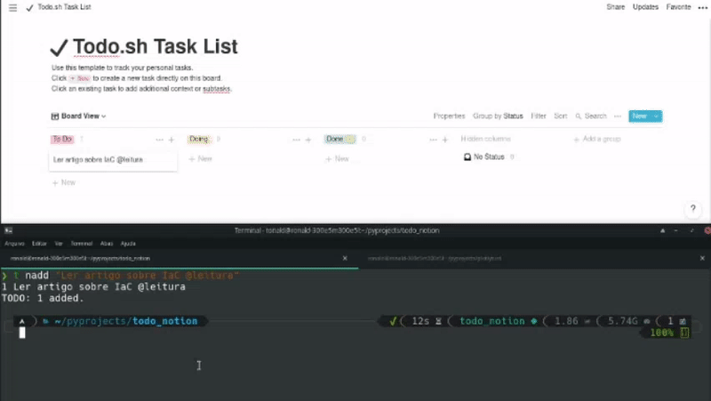
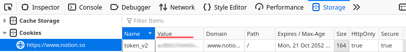

# todo.sh-notion

Integration between todo.sh and Notion Task Lists!

**Motivation**:

To helps the `todo.sh` users to sync your tasks with Notion. Without quiting the terminal or doing something extra effort. For me, who have focus problems, it helps a lot.

## Pre configuration

You need to provide two environment variables to allow the integration (put it in your .bashrc if you want):

    export NOTION_TOKEN_V2=''
    export NOTION_TASK_LIST_URL=''

To catch the `NOTION_TOKEN_V2` you need to go into https://notion.so page and enable the browser devtools,
find a token_v2 in cache and copy the value.

To catch the `NOTION_TASK_LIST_URL` it's quite simple, just navigate to your Task List and copy the URL.

## Installation

It's important that the `todonotion` command be available globally (like todo.sh)
so, we will install using the flag --user that installs the package in your personal directory for python dependencies.

    pip install todo.sh-notion --user

After that, we run the command:

    todonotion configure

This will create the `todo.sh` actions in `~/.todo.actions.d`:

- `nadd` like `add`, but **creates** the card in notion task list too.
- `ndo` like `done`, but **moves** the card in notion task list too.
- `ndoc` like `done`, but this allow you to perform actions in all cards by @context or any text part that contains in card titles, **moves** the cards in notion task list too.
- `ndel` like `del`, deletes by task ids, **delete** the card in notion task list too.
